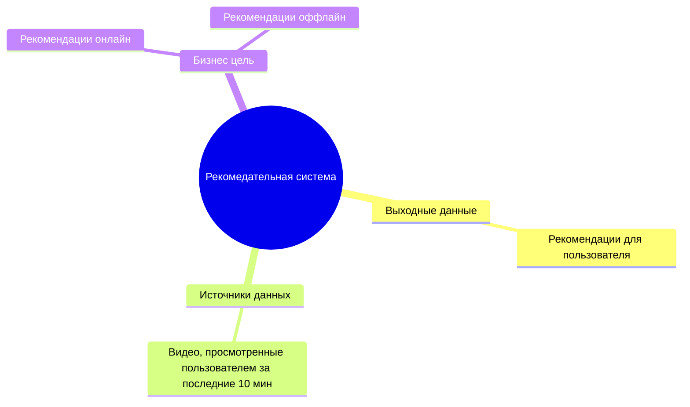
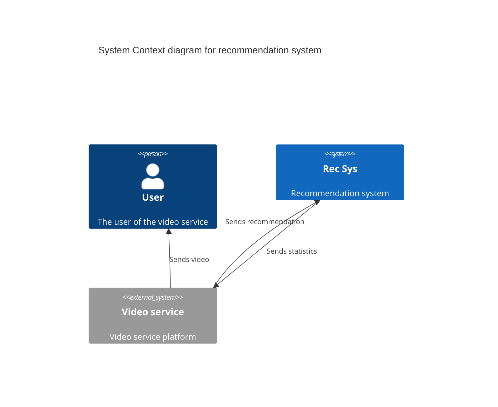
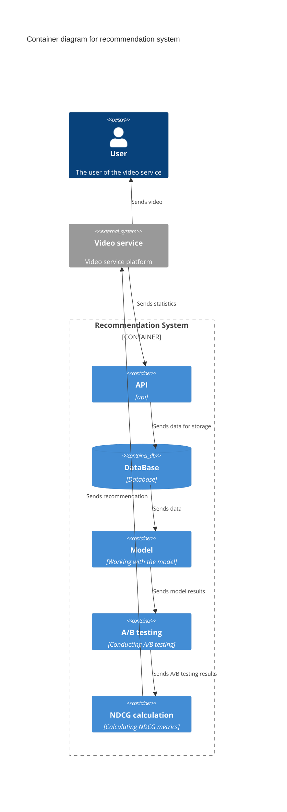
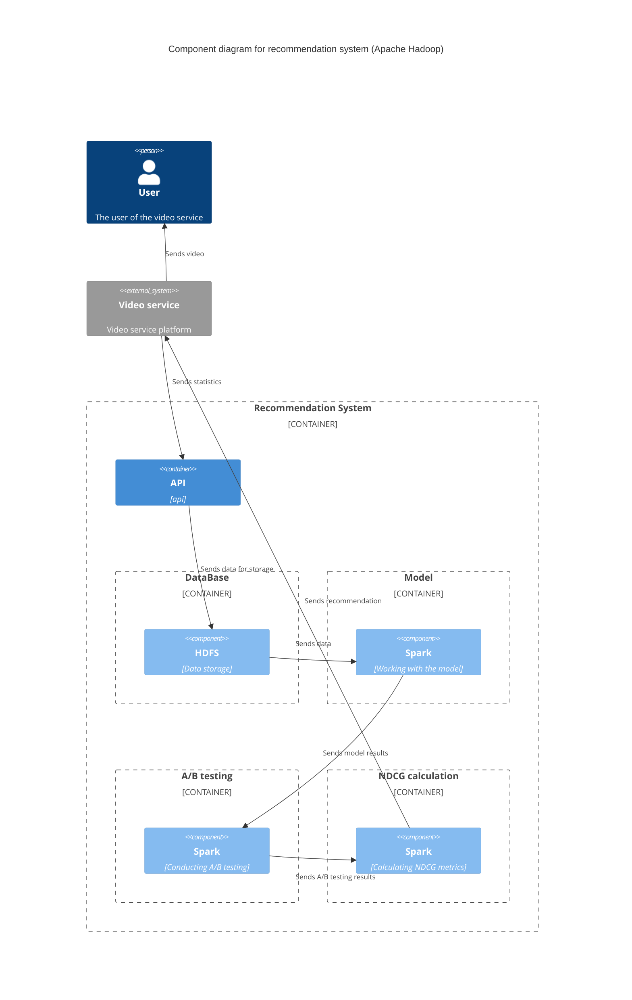
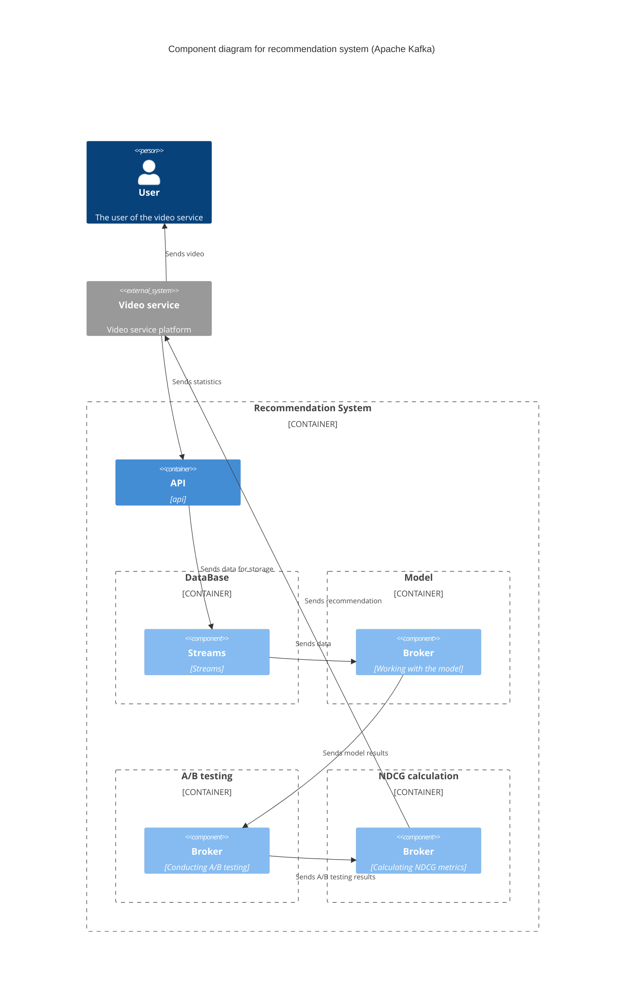

# ML_big_data_HW_Karnauhova
# Mindmap

```mermaid
mindmap
  root((Рекомедательная система))
    Выходные данные
      Рекомендации для пользователя
    Источники данных
      Видео, просмотренные пользователем за последние 10 мин
    Бизнес цель
      Рекомендации онлайн
      Рекомендации оффлайн
```

# C4

## Context

```mermaid
C4Context
    title System Context diagram for recommendation system
    Person(user, "User", "The user of the video service")
    System(recSys, "Rec Sys", "Recommendation system")
    System_Ext(video_service, "Video service", "Video service platform")

    Rel(recSys, video_service, "Sends recommendation")
    Rel(video_service, user, "Sends video")
    Rel(video_service, recSys, "Sends statistics")
    

    UpdateLayoutConfig($c4ShapeInRow="2")
    UpdateRelStyle(recSys, video_service, $offsetY="-40")
    UpdateRelStyle(recSys, video_service, $offsetX="-70")
    UpdateRelStyle(video_service, recSys, $offsetY="10")
```
## Container

```mermaid
C4Container
    title Container diagram for recommendation system
    Person(user, "User", "The user of the video service")
    System_Ext(video_service, "Video service", "Video service platform")
    Container_Boundary(c1, "Recommendation System") {
        Container(api, "API", "api")
        ContainerDb(db, "DataBase", "Database")
        Container(model, "Model",  "Working with the model")
        Container(ab, "A/B testing", "Conducting A/B testing")
        Container(ndcg, "NDCG calculation",  "Calculating NDCG metrics")

    }

    Rel(ndcg, video_service, "Sends recommendation")
    Rel(video_service, user, "Sends video")
    Rel(video_service, api, "Sends statistics")

    Rel(api, db, "Sends data for storage")
    Rel(db, model, "Sends data")
    Rel(model, ab, "Sends model results")
    Rel(ab, ndcg, "Sends A/B testing results")
    

    UpdateLayoutConfig($c4ShapeInRow="1")
    UpdateRelStyle(ndcg, video_service, $offsetX="-100")
    UpdateRelStyle(ndcg, video_service, $offsetY="30")
    UpdateRelStyle(video_service, api, $offsetY="-30")
```
## Component (Apache Hadoop)

```mermaid
C4Component
    title Component diagram for recommendation system (Apache Hadoop)
    Person(user, "User", "The user of the video service")
    System_Ext(video_service, "Video service", "Video service platform")
    Container_Boundary(c1, "Recommendation System") {
        Container(api, "API", "api")
        Container_Boundary(db, "DataBase") {
        Component(hdfs, "HDFS",  "Data storage")
    }
        Container_Boundary(model, "Model") {
        Component(spark_model, "Spark",  "Working with the model")
    }
    Container_Boundary(ab, "A/B testing") {
        Component(spark_ab, "Spark",  "Conducting A/B testing")
    }
    Container_Boundary(ndcg, "NDCG calculation") {
        Component(spark_ndcg, "Spark",  "Calculating NDCG metrics")
    }

    }

    Rel(spark_ndcg, video_service, "Sends recommendation")
    Rel(video_service, user, "Sends video")
    Rel(video_service, api, "Sends statistics")

    Rel(api, hdfs, "Sends data for storage")
    Rel(hdfs, spark_model, "Sends data")
    Rel(spark_model, spark_ab, "Sends model results")
    Rel(spark_ab, spark_ndcg, "Sends A/B testing results")
    

    UpdateLayoutConfig($c4ShapeInRow="1")
    UpdateRelStyle(spark_ndcg, video_service, $offsetX="30")
    UpdateRelStyle(spark_ndcg, video_service, $offsetY="30")
    UpdateRelStyle(video_service, api, $offsetY="-30")
    UpdateRelStyle(spark_ab, spark_ndcg, $offsetY="30")
    UpdateRelStyle(spark_ab, spark_ndcg, $offsetX="-30")
    UpdateRelStyle(hdfs, spark_model, $offsetX="-30")
    UpdateRelStyle(hdfs, spark_model, $offsetY="-30")

```

## Component (Apache Kafka)

```mermaid
C4Component
    title Component diagram for recommendation system (Apache Kafka)
    Person(user, "User", "The user of the video service")
    System_Ext(video_service, "Video service", "Video service platform")
    Container_Boundary(c1, "Recommendation System") {
        Container(api, "API", "api")
        Container_Boundary(db, "DataBase") {
        Component(streams, "Streams",  "Streams")
    }
        Container_Boundary(model, "Model") {
        Component(broker_model, "Broker",  "Working with the model")
    }
    Container_Boundary(ab, "A/B testing") {
        Component(broker_ab, "Broker",  "Conducting A/B testing")
    }
    Container_Boundary(ndcg, "NDCG calculation") {
        Component(broker_ndcg, "Broker",  "Calculating NDCG metrics")
    }

    }

    Rel(broker_ndcg, video_service, "Sends recommendation")
    Rel(video_service, user, "Sends video")
    Rel(video_service, api, "Sends statistics")

    Rel(api, streams, "Sends data for storage")
    Rel(streams, broker_model, "Sends data")
    Rel(broker_model, broker_ab, "Sends model results")
    Rel(broker_ab, broker_ndcg, "Sends A/B testing results")
    

    UpdateLayoutConfig($c4ShapeInRow="1")
    UpdateRelStyle(broker_ndcg, video_service, $offsetX="30")
    UpdateRelStyle(broker_ndcg, video_service, $offsetY="30")
    UpdateRelStyle(video_service, api, $offsetY="-30")
    UpdateRelStyle(broker_ab, broker_ndcg, $offsetY="30")
    UpdateRelStyle(broker_ab, broker_ndcg, $offsetX="-30")
    UpdateRelStyle(streams, broker_model, $offsetX="-30")
    UpdateRelStyle(streams, broker_model, $offsetY="-30")

```
